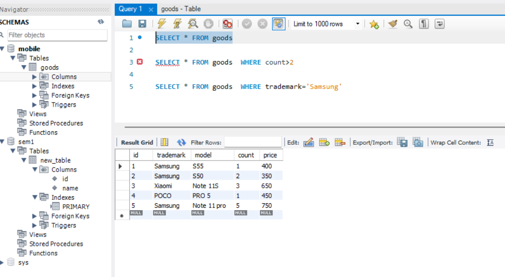
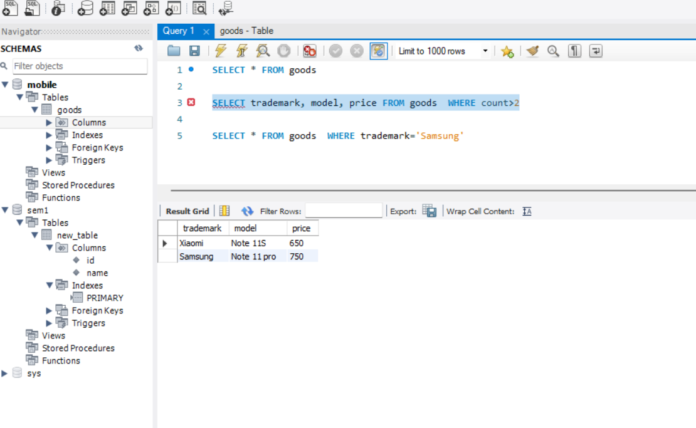
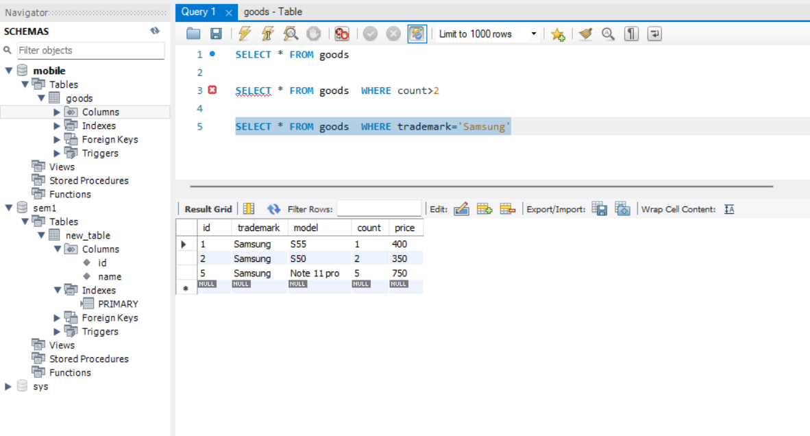

#### 1. Создайте таблицу с мобильными телефонами, используя графический интерфейс. Заполните БД данными

#### 2. Выведите название, производителя и цену для товаров, количество которых превышает 2

#### 3. Выведите весь ассортимент товаров марки “Samsung”

